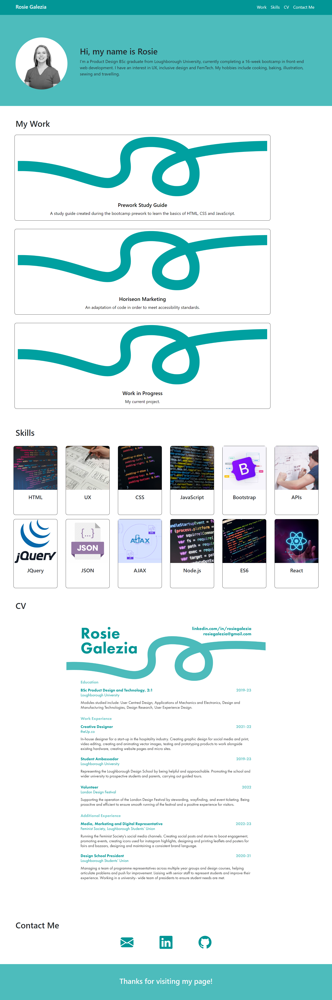

# Bootstrap-Portfolio
Personal portfolio created using Bootstrap to practice using Bootstrap and making responsive pages.

## Description

This project is a second iteration of a personal portfolio website. It is a developed version of the website created last week (https://github.com/rosiegalezia/week-2-portfolio), improved and made more responsive thanks to the use of Bootstrap 5.

It resolves some of the issues from the first iteration, mainly the problems with responsiveness, and utilises cards and bootstrap icons for improved user experience.

Building this website was a good opportunity to practice using bootstrap and become familiar with its advantages, as well as to observe some of the disadvantages. The main disadvantage encountered was an issue whereby parts of the site were being hidden by the fixed bootstrap navbar. A workaround was created, as can be seen in lines 12-20 of the CSS style sheet.

## Installation

Copy the following link: https://github.com/rosiegalezia/Bootstrap-Portfolio.git

Open Git Bash

Change the current working directory to the desired location for the cloned directory using the cd command

Use the command git clone followed by the url https://github.com/rosiegalezia/Bootstrap-Portfolio.git and press enter to clone locally

## Usage

The website is available at https://rosiegalezia.github.io/Bootstrap-Portfolio/

An image of the website's appearance is shown here:

## Credits

Shoutout to Steve Calla for helping me resolve the issue with content hiding behind the nevbar.

## License

MIT License

Copyright (c) 2023 rosiegalezia

Permission is hereby granted, free of charge, to any person obtaining a copy
of this software and associated documentation files (the "Software"), to deal
in the Software without restriction, including without limitation the rights
to use, copy, modify, merge, publish, distribute, sublicense, and/or sell
copies of the Software, and to permit persons to whom the Software is
furnished to do so, subject to the following conditions:

The above copyright notice and this permission notice shall be included in all copies or substantial portions of the Software.

THE SOFTWARE IS PROVIDED "AS IS", WITHOUT WARRANTY OF ANY KIND, EXPRESS OR
IMPLIED, INCLUDING BUT NOT LIMITED TO THE WARRANTIES OF MERCHANTABILITY,
FITNESS FOR A PARTICULAR PURPOSE AND NONINFRINGEMENT. IN NO EVENT SHALL THE
AUTHORS OR COPYRIGHT HOLDERS BE LIABLE FOR ANY CLAIM, DAMAGES OR OTHER
LIABILITY, WHETHER IN AN ACTION OF CONTRACT, TORT OR OTHERWISE, ARISING FROM,
OUT OF OR IN CONNECTION WITH THE SOFTWARE OR THE USE OR OTHER DEALINGS IN THE
SOFTWARE.